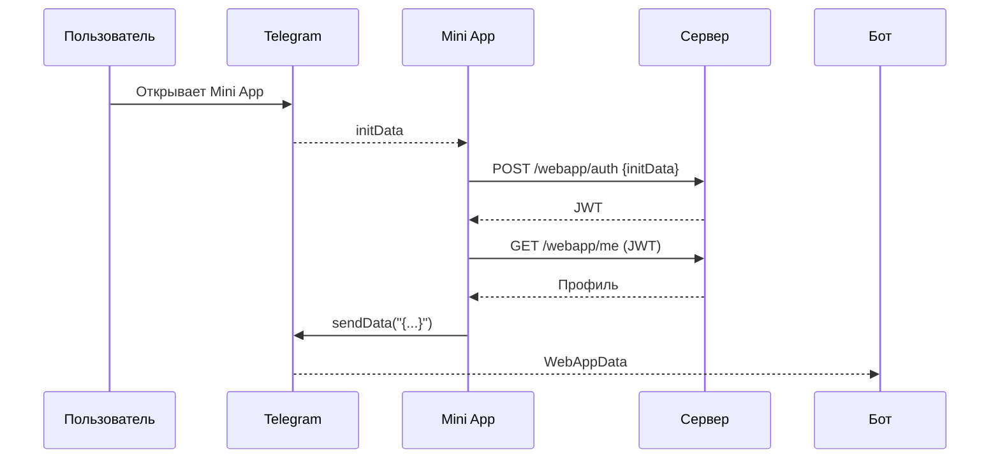

# Mini App

Мини-приложение позволяет открыть веб-интерфейс из Telegram и обмениваться данными с ботом.

## Включение Mini App

1. В @BotFather включите домен через `/setdomain`.
2. Привяжите кнопку меню или инлайн-кнопку с полем `web_app`.
3. Убедитесь, что страница доступна по HTTPS и совпадает с указанным доменом.

## Конфигурация

Серверная часть использует настройки `WebApp` и строгую политику безопасности через `UseStrictCspForWebApp`.

```json
{
  "WebApp": {
    "Secret": "0123456789ABCDEF0123456789ABCDEF",
    "PublicUrl": "https://example.com",
    "AuthTtlSeconds": 300,
    "InitDataTtlSeconds": 300,
    "Csp": {
      "AllowedOrigins": [
        "https://example.com"
      ]
    }
  }
}
```

### Конфигурационные ключи

`WebApp__Secret`, `WebApp__PublicUrl`, `WebApp__AuthTtlSeconds`, `WebApp__InitDataTtlSeconds`, `WebApp__Csp__AllowedOrigins__0`.

### Настройка CSP

Метод `UseStrictCspForWebApp` принимает список разрешённых origin'ов и добавляет заголовки `Content-Security-Policy`, `Referrer-Policy`, `X-Content-Type-Options` и `X-Frame-Options`.

### Кнопки через `IBotUi`

Чтобы выдать кнопку Mini App, используйте `IBotUi`:

```csharp
await botUi.SendMenuWebAppAsync(chat, "Открыть", "https://example.com", ct);
```

Методы `SendInlineWebAppAsync` и `SendReplyWebAppAsync` добавляют кнопку в соответствующую клавиатуру.

## Обмен данными

1. Клиент получает `initData` из Telegram.
2. **Авторизация** — `POST /webapp/auth` с телом `{ "initData": "<...>" }` возвращает короткий JWT.
3. **Профиль** — `GET /webapp/me` с заголовком `Authorization: Bearer <jwt>`.
4. **Отправка в бот** — `Telegram.WebApp.sendData("{...}")`.

Базовый поток: `auth → me → sendData`.

## Типовые ошибки

| Эндпоинт | Код | Причина |
|---------|-----|---------|
| `/webapp/auth` | 400 | HTTP или неверный `user` |
| `/webapp/auth` | 401 | Недействительная подпись `initData` |
| `/webapp/me`   | 401 | Отсутствует или истёк JWT |

## Схема потоков



## Быстрый старт за 30 минут

1. Поднимите шаблон бота и добавьте конфигурацию `WebApp` с `UseStrictCspForWebApp`.
2. В `main.js` авторизуйтесь и запросите профиль:

    ```javascript
    const initData = Telegram.WebApp.initData;
    const auth = await fetch('/webapp/auth', {
        method: 'POST',
        headers: { 'Content-Type': 'application/json' },
        body: JSON.stringify({ initData })
    }).then(r => r.json());
    await fetch('/webapp/me', {
        headers: { Authorization: `Bearer ${auth.token}` }
    });
    ```

3. Передайте данные в бота: `Telegram.WebApp.sendData(JSON.stringify({ ping: 1 }));`.
4. Добавьте кнопку через `IBotUi.SendMenuWebAppAsync` и откройте Mini App.
5. Эти шаги позволяют поднять Mini App менее чем за полчаса.
