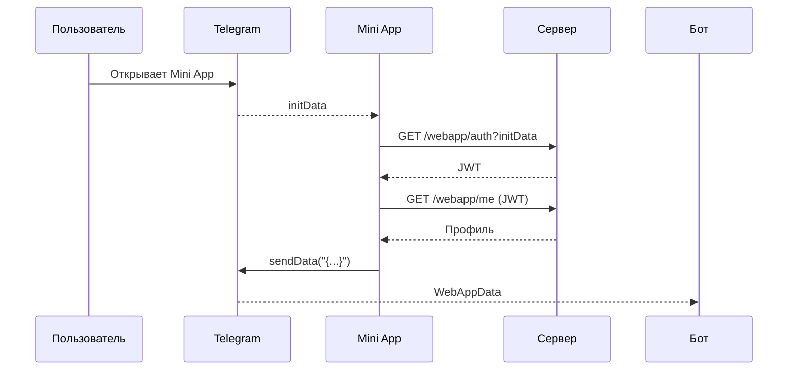

# Mini App

Мини-приложение позволяет открыть веб-интерфейс из Telegram и обмениваться данными с ботом.

## Включение Mini App

1. В @BotFather включите домен через `/setdomain`.
2. Привяжите кнопку меню или инлайн-кнопку с полем `web_app`.
3. Убедитесь, что страница доступна по HTTPS и совпадает с указанным доменом.

## Конфигурация

Серверная часть использует `WebAppAuthOptions` и строгую политику безопасности через `UseStrictCspForWebApp`.

```json
{
  "WebAppAuthOptions": {
    "Secret": "0123456789ABCDEF0123456789ABCDEF"
  },
  "WebAppCsp": {
    "AllowedOrigins": [
      "https://example.com"
    ]
  }
}
```

*Переменные окружения:* `WebAppAuthOptions__Secret`, `WebAppCsp__AllowedOrigins__0`.

Метод `UseStrictCspForWebApp` принимает список разрешённых origin'ов и добавляет заголовки `Content-Security-Policy`, `Referrer-Policy`, `X-Content-Type-Options` и `X-Frame-Options`.

## Обмен данными

1. Клиент получает `initData` из Telegram.
2. **Авторизация** — `GET /webapp/auth?initData=<...>` возвращает короткий JWT.
3. **Профиль** — `GET /webapp/me` с заголовком `Authorization: Bearer <jwt>`.
4. **Отправка в бот** — `Telegram.WebApp.sendData("{...}")`.

## Типовые ошибки

| Эндпоинт | Код | Причина |
|---------|-----|---------|
| `/webapp/auth` | 400 | HTTP или неверный `user` |
| `/webapp/auth` | 401 | Недействительная подпись `initData` |
| `/webapp/me`   | 401 | Отсутствует или истёк JWT |

## Схема потоков


